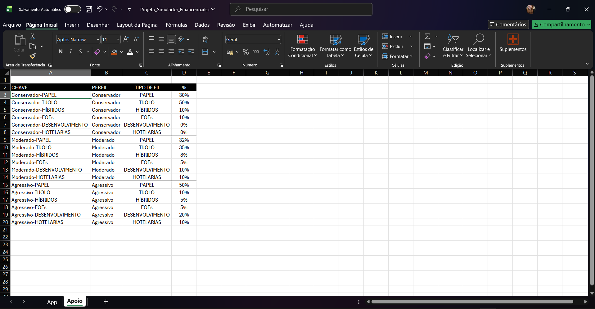

# Simulador de Investimentos em Fundos Imobiliários

## 📋 Sobre o Projeto

Este projeto foi desenvolvido como parte do desafio prático do curso de Excel com IA, com o objetivo de criar uma ferramenta de simulação de investimentos em fundos imobiliários (FIIs). A planilha permite que investidores realizem simulações financeiras detalhadas, auxiliando na tomada de decisões mais informadas sobre seus investimentos.

## 🎯 Objetivos

O simulador foi criado para responder às principais perguntas de investidores em fundos imobiliários:

- Quanto investir mensalmente?
- Por quanto tempo manter o investimento?
- Qual a taxa de rendimento esperada?
- Qual será o patrimônio acumulado ao final do período?
- Quanto em dividendos mensais posso esperar receber?

## 🚀 Funcionalidades

A planilha oferece as seguintes funcionalidades:

- **Simulação de Patrimônio Acumulado**: Projeção do crescimento do patrimônio com base nos aportes e rendimentos
- **Cálculo de Dividendos Mensais**: Estimativa dos dividendos recebidos mensalmente 
- **Análise de Cenários**: Possibilidade de simular diferentes valores de aporte, períodos e taxas de retorno
- **Visualização Clara**: Interface intuitiva com resultados organizados e de fácil interpretação

## 💡 Conceitos e Fórmulas Aplicadas

Durante o desenvolvimento deste projeto, foram aplicados os seguintes recursos do Excel:

### Fórmulas Principais

- **PROCV**: Utilizada para buscar e relacionar dados de diferentes tabelas, facilitando a consulta de informações de fundos imobiliários e suas características
- **VF (Valor Futuro)**: Aplicada para calcular o valor futuro dos investimentos, considerando aportes mensais, taxa de rendimento e período de investimento
- **CONCATENAR**: Empregada para combinar textos e valores, criando mensagens dinâmicas e relatórios personalizados dentro da planilha

### Técnicas de Formatação

- **Estilização de Células**: Aplicação de cores, bordas e fontes para melhorar a legibilidade e organização visual
- **Formatação de Números**: Configuração adequada para valores monetários, percentuais e datas
- **Mesclagem e Alinhamento**: Organização estratégica de células para criar cabeçalhos e seções claras

### Outras Funcionalidades

- Validação de dados para entrada de informações consistentes
- Gráficos para representação visual
- Tabelas estruturadas para melhor organização dos dados

## 📊 Como Utilizar

1. Abra a planilha no Microsoft Excel
2. Preencha os campos de entrada:
   - Valor do salário
   - Valor do aporte mensal
   - Período do investimento (em anos)
   - Taxa de rendimento mensal (%)
   - Perfil de Investidor
3. Os resultados serão calculados automaticamente utilizando as fórmulas VF e PROCV
4. Analise as tabelas geradas com formatação personalizada e considere os cenários sugeridos

## 🎓 Aprendizados

Este desafio permitiu desenvolver habilidades em:

- ✅ Criação de ferramentas de simulação financeira em Excel
- ✅ Aplicação de fórmulas avançadas (PROCV, VF, CONCATENAR)
- ✅ Técnicas de estilização e formatação profissional de planilhas
- ✅ Cálculos financeiros complexos (rendimento mensal, dividendos, valor futuro)
- ✅ Documentação técnica estruturada
- ✅ Utilização do GitHub para compartilhamento de projetos
- ✅ Pensamento analítico aplicado a investimentos

## 🛠️ Tecnologias Utilizadas

- Microsoft Excel
- Fórmulas financeiras (VF) e de busca (PROCV)
- Funções de texto (CONCATENAR)
- Técnicas de formatação e estilização
- GitHub para versionamento e documentação

## 📝 Estrutura do Repositório
```
/
├── README.md                          # Documentação do projeto
├── simulador-investimentos-fii.xlsx   # Planilha do simulador 
└── prints/                            # Capturas de tela 
    ├── Interface-1.png
    ├── Interface_2.png
    └── PLanilha_Apoio_ProcV.png
```

## 📸 Capturas de Tela

### Interface Principal


### Tabela de Apoio




## 👤 Autor: Natacha de Andrade

Desenvolvido como parte do Bootcamp de Excel com IA da DIO.me em parceria com o Santander Bolsas.

---

## 📌 Observações

Este projeto foi desenvolvido com finalidade educacional, como parte do desafio prático do curso. Os cálculos e simulações apresentados não constituem recomendação de investimento. Sempre consulte um profissional qualificado antes de tomar decisões financeiras.

---

**Data de Conclusão**: Janeiro de 2026


**Status do Projeto**: ✅ Concluído
